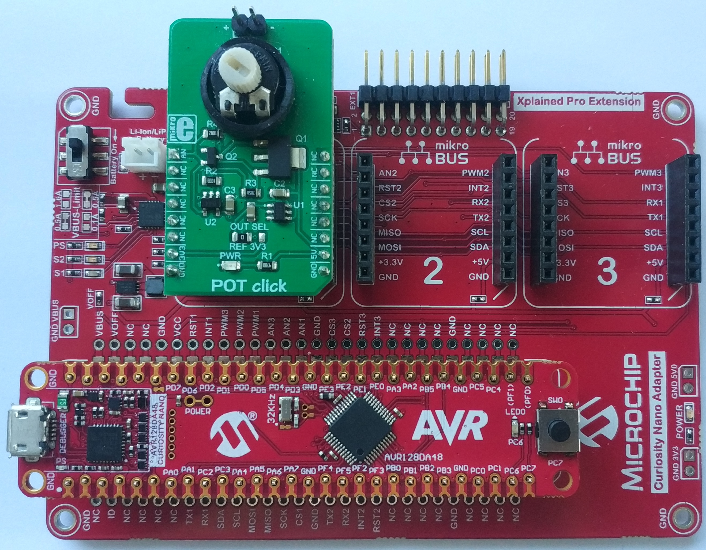
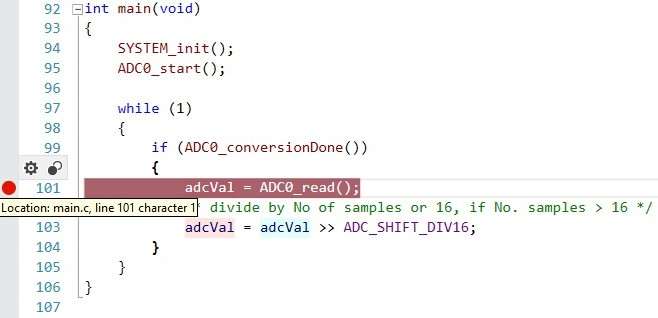
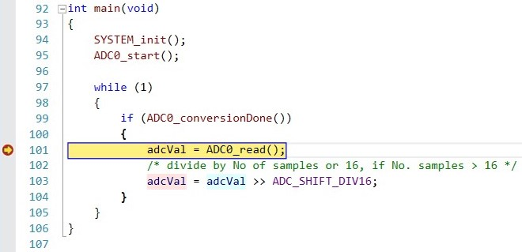
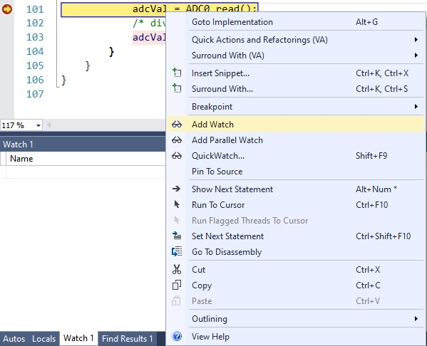
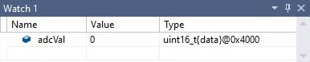
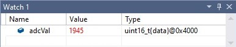

 <article class="markdown-body entry-content p-3 p-md-6" itemprop="This needs to locked down and 'never' changed">

# AVR128DA48 ADC Accumulation Code Example

The AVR128DA48 features one 12-bit ADC with accumulation of up to 128 samples per conversion.
In this demo, a POT click board will be attached to the mikroBus socket #1 of a Curiosity Nano Adapter and the analog value provided by the potentiometer will be read using AIN3 channel, corresponding to PD3 pin.

## Related Documentation
More details and code examples on the AVR128DA48 can be found at the following links:
- [AVR128DA48 Product Page](https://www.microchip.com/wwwproducts/en/AVR128DA28)
- [AVR128DA48 Code Examples on GitHub](https://github.com/microchip-pic-avr-examples?q=avr128da48)
- [AVR128DA48 Project Examples in START](https://start.atmel.com/#examples/AVR128DA48CuriosityNano)

## Software Used
- Atmel Studio 7.0.2397 or newer [(microchip.com/mplab/avr-support/atmel-studio-7)](https://www.microchip.com/mplab/avr-support/atmel-studio-7)
- AVR-Dx 1.0.18 or newer Device Pack

## Hardware Used
- AVR128DA48 Curiosity Nano [(DM164151)](https://www.microchip.com/Developmenttools/ProductDetails/DM164151)
- Curiosity Nano Base for Click boards™ [(AC164162)](https://www.microchip.com/Developmenttools/ProductDetails/AC164162)
- POT Click board™ [(MIKROE-3402)](https://www.mikroe.com/pot-click)

## Setup
The AVR128DA48 Curiosity Nano Development Board is used as test platform, along with the Curiosity Nano Base for Click boards™ and the POT Click board™.
 

The following configurations must be made for this project:

- ADC0 - Configured in Free Run Mode to accumulate 64 samples
- VREF - Reference voltage for ADC0 set to 2.048V

|Pin           | Configuration      |
| :----------: | :----------------: |
|PD3           | Analog Input       |

## Operation
To visualize the read ADC value, follow the instructions below.
1. Open the "AVR_DA_ADC_accumulation.atsln" project solution in Atmel Studio

2. In `main` function from main.c file, add a breakpoint on line 101
     

3. Run the project in Debug Mode (shortcut: F5)
     
     

4. Right click on `adcVal` variable and select Add Watch
     

    In the watch window, `adcVal` was added and its value is 0 because up to this point, it hasn't been changed.
     

5. Continue debugging (shortcut: F5) to read the value from ADC
     

6. In the watch window, `adcVal` value should be the one returned by ADC read.
     

## Summary
The demo shows how an ADC accumulation can be made using the 12-bit ADC peripheral on the new AVR-DA family.
This project highlights the configuration of ADC to run in Free Run Mode and accumulate 64 samples.
